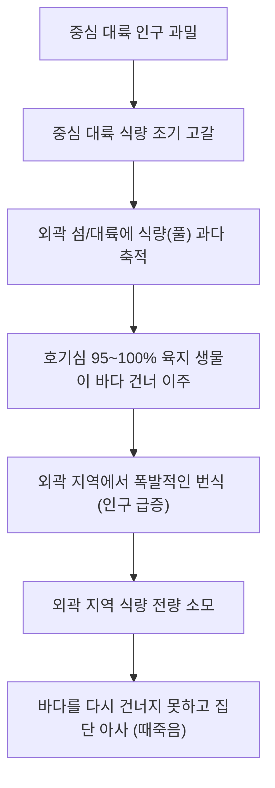

# 제네시스 시뮬레이션 생태 특이사항 관리 문서 (Ecosystem Anomalies Log)

본 문서는 시뮬레이션 운영 중 발견된 특이 생태학적 현상, 진화적 병목(Bottleneck), 그리고 특정 유전자 군집의 대규모 붕괴(때죽음) 등의 예외 사례를 기록하고 관리하는 공간입니다.

---

## 📌 특이사항 01: 초-호기심 개척자의 섬 함정 현상 (Curious Pioneer Island Trap)

> [!WARNING]
> **현상 요약:**
> 중심 대륙의 인구 과밀로 자원이 고갈되었을 때, 극도로 높은 호기심(95%~100%)을 가진 육지 개척자들이 바다를 건너 식량이 풍부한 외곽 섬/대륙으로 이주하여 번성한 뒤, 자원 고갈과 함께 집단 아사하는 생태학적 고립 현상입니다.

### 1. 현상 발생 메커니즘

### 2. 현상 캡처 및 증거 자료

### 3. 세부 요인 분석

* **중심 대륙의 자원 고갈:**
  - 대부분의 육지 생물이 중심 대륙에서 시작해 번식하므로 식량 소모 속도가 매우 빠릅니다.
* **외곽 지역의 식량 몰림 현상:**
  - 식물 스폰 시스템(`PlantSpawnSystem`)은 맵 전체에 무작위로 풀을 채워 넣습니다.
  - 보통의 개체(호기심 70% 미만)는 바다를 건너지 못하므로 외곽 섬이나 건너편 대륙의 풀은 아무도 먹지 않아 **엄청난 밀도로 축적**됩니다.
* **용맹한 개척자의 이주:**
  - 호기심 유전자가 95%~100%인 극단적인 탐험가 개체(예: ID 15266 개체)들이 맵 전역 스캔을 통해 바다 건너편에 쌓인 엄청난 양의 식량을 감지하고 바다를 헤엄쳐 건너갑니다.
* **인구 폭발과 고립:**
  - 이주한 개척자들이 식량이 풍부한 외곽 땅에 안착하여 급격하게 번식합니다. 자손들 역시 부모의 높은 호기심 유전자(95% 이상)를 상속받습니다.
* **자원 고갈과 멸종:**
  - 외곽 지역의 식량이 전부 바닥나면, 개체들은 다시 밥을 찾아 이동해야 합니다.
  - 하지만 중심 대륙은 이미 다른 생물들이 자원을 갉아먹고 있어 식량이 부족한 상태입니다.
  - 결국 다시 돌아오지 못하고, 물을 건너다 익사하거나 외곽 섬 안에서 **단체로 굶어 죽는 집단 아사(때죽음) 현상**이 발생합니다.

### 4. 관찰 데이터 예시 (ID: 15266 개체)
| 유전자 및 상태 | 수치 및 특징 | 생태적 역할 |
| :--- | :--- | :--- |
| **친수성 (Aquatic)** | `3%` (완전한 육지 생물) | 물에 들어가면 호흡이 빠르게 감소함 |
| **호기심 (Curiosity)** | `100%` (실질 100%) | 지형 페널티를 신경 쓰지 않고 바다를 건넘 |
| **털 밀도 (Fur)** | `0.16` | 사막 기후에 특화됨 |
| **현재 상태** | `호흡 69/100` | 현재 바다를 헤엄쳐 건너는 중 (질식 위험 노출) |

---

## 💡 분석 및 향후 조율 의견

이 현상은 유전 알고리즘 기반 시뮬레이션에서 나타나는 매우 현실적인 **"자원 분포 불균형에 따른 이주민 생태 붕괴"** 모델입니다. 

* **생태학적 의의:** 극단적인 호기심 유전자(95% 이상)는 풍부한 자원을 선점하는 **'개척자'** 역할을 하지만, 동시에 고립된 지역에서 인구 과밀을 유발해 유전적 몰살을 당하는 **'고위험-고수익(High Risk-High Return)'** 유전자임을 보여줍니다.
* **대응 옵션 및 해결 조치 [APPLIED]:** 
  - 이 현상으로 인해 외곽 지역에 밥이 무한정 축적되어 고립지 때죽음이 반복되는 문제를 막고자 **"육지 식물 시들기 및 소멸/재생성 로직"**을 전격 적용했습니다.
  - **세부 규칙:** 육지 식물(풀)은 스폰 후 **3분(180초)**이 지나면 누런빛으로 시들어 포만감 효율이 **2/3**로 떨어집니다. **모든 식물(풀 및 해조류)**은 **5분(300초)**이 지나면 완전히 소멸하며, 소멸된 만큼 맵의 다른 무작위 위치에 새롭게 리스폰됩니다.
  - **예외 사항:** 바다 식물(해조류)은 **바닷물이 짜서 시들지 않는 특성**을 가지므로 3분이 지나도 영양가 감쇠와 변색이 발생하지 않으나, 5분이 지나면 마찬가지로 자연 소멸하여 리스폰됩니다.
  - **효과:** 외곽 고립 지역의 식량이 주기적으로 소멸해 중심 대륙으로 자동 재분배되므로 자원 잠금(Resource Locking)이 풀리며, 개체들이 고립 지역에서 인구 폭발 후 단체 멸종하는 빈도가 효과적으로 완화되었습니다.
  - **추가 관찰:** 이후 이 현상을 계속 모니터링한 결과, 순환 조치 없이 방치하더라도 시간이 오래 흐르면 멸종하지 않고 스스로 200명 선으로 복구되는 강력한 복원력을 보여주었습니다. 이에 따라 과도한 개입을 막기 위해 시들기 시간을 3분, 소멸 리스폰 주기를 5분으로 늘려 개체들이 자연적으로 적응할 여지를 더 많이 주도록 쿨타임을 조율했습니다.

---

## 📌 특이사항 02: 인구 임계치 도달의 역사적 순간 (인구 498명 돌파)

> [!NOTE]
> **기록 의의:**
> 생명 연장(부활/종교 등) 시스템이 도입되기 이전 상태에서, 생태계가 자생적 균형과 번식을 통해 시스템 최대 제한 인구(`500마리`) 직전인 **498마리**를 달성한 역사적인 순간입니다.

### 1. 현상 캡처 및 기록 자료

### 2. 주요 관찰 분석

* **극단적인 자원 압박:**
  - 인구가 `498/500`에 달했을 때, 전체 식량 수량은 `237/2000`으로 크게 억제되어 있습니다.
  - 이는 인구가 늘어남에 따라 맵 전역의 식량을 매우 빠른 속도로 소모하여 생태계 전반에 **극심한 식량 경쟁 압박**이 가해지고 있음을 의미합니다.
* **시스템 회복력(Resilience):**
  - 자원 순환 쿨타임 버프(3분 시들기 / 5분 소멸 리스폰) 조정을 거친 뒤, 인구 집단이 붕괴하지 않고 스스로 적응하여 시스템 한계점까지 성장하는 탁월한 복원력을 보여주었습니다.
  - 이 기록은 향후 추가될 **부활(Rebirth) 및 종교/신앙 업데이트** 이전의 생태 순수 피지컬 최고 기록으로 남게 됩니다.

